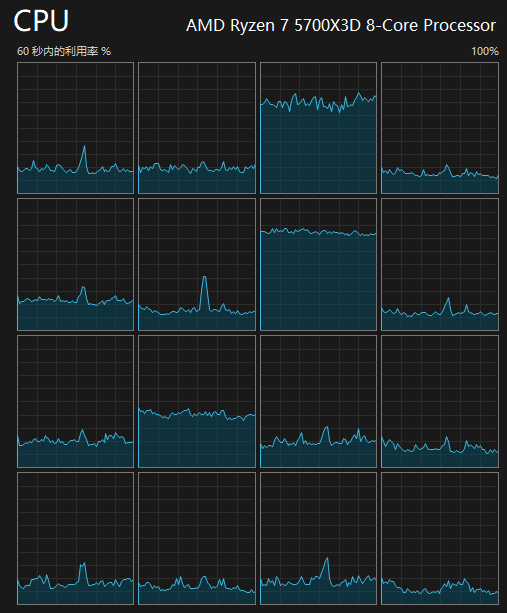
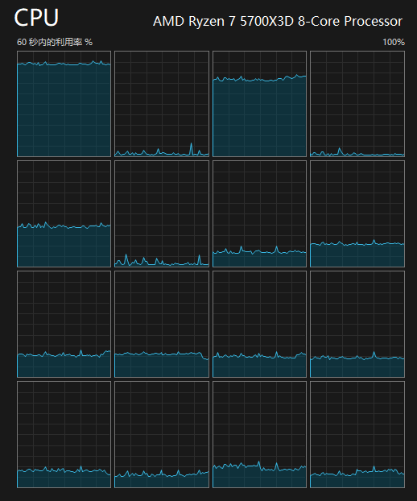

<div align="center">

[Release]: https://github.com/Yukiriri/ReimaginedScheduling/releases

[]()

# ReimaginedScheduling

[](
  https://github.com/Yukiriri/ReimaginedScheduling/actions/workflows/build.yml
)
[][Release]

</div>

通过读取前台游戏的线程信息，重新规划线程分配，让重要线程适当独占核心，提高CPU理论渲染性能的天花板，并减少一些波动，帮助高端CPU更上一层楼。  
Intel和AMD都可以用，重点针对AMD改善，让AMD用户可以同等安心玩游戏。  
由于我拥有的硬件和游戏有限，目前已涵盖范围还比较少，期待能和大家一起完善，如果在特定情况遇到问题或者有建议，欢迎提出。  

> [!IMPORTANT]
> 现在将进入一段长时间的程序重构，开始写UI了  

# 实现原理
- [核心与线程规划](./md/thread.md)

# 食用效果
<details><summary>食用前</summary>


</details>
<details><summary>食用后</summary>


</details>

# 食用方式
1. 前往 [Release] 选择下载自动构建的exe  
> [!NOTE]
> 总物理核心低于4核就非常不建议使用了，正如我所说，我的程序是让高端CPU更上一层楼  
> 除非尝试运行后确认可以缓解某些瓶颈，不然大概率在低核心CPU上会是负优化  

1. 各exe使用方式  
- `ReimaginedScheduling.CLI.Manual.exe`  
  1. 直接运行并保持，直到不需要使用  
  2. 开始玩游戏  
  3. 在游戏中按下提示的快捷键  
- ~~`ReimaginedScheduling.Start.exe`~~(未完成)  
  传入参数运行（适合搭配快捷方式）  
  ```
  "...\ReimaginedScheduling.Start.exe" "...\游戏.exe"
  ```
- `ReimaginedScheduling.CLI.Viewer.exe`  
  给专业人士采集线程数据并向我提交建议用的  
> [!NOTE]
> 修改游戏线程的时效性持续到游戏进程结束，非持久修改  

# 调优避坑
- ## 系统设置
  |                 | 系统版本 | N卡        | A卡      | I卡          |
  | :-------------- | :------- | :--------- | :------- | :----------- |
  | 硬件加速GPU计划 | <=23H2   | 建议不开   | 不支持   | 没用过不知道 |
  | 硬件加速GPU计划 | >=24H2   | 不开白不开 | 不支持   | 没用过不知道 |
  | 窗口化游戏优化  | <=23H2   | 建议不开   | 建议不开 | 没用过不知道 |
  | 窗口化游戏优化  | >=24H2   | 建议不开   | 建议开启 | 没用过不知道 |
- ## AMD注意项
  - ## BIOS
    - ### PSS Support(Cool n Quite)
      ### 强烈建议别关
      关掉后将连带关闭`CPPC v2`等诸多硬件自主性能调节，没有了`CPPC v2`，就要让Windows承担这个操作，而Windows的性能调节极其迟钝  
      打开`Windows事件查看器`，筛选`Kernel-Processor-Power`事件，会看见`ACPI None`，有CPPC的情况是`ACPI CPPC`  
      关掉的影响：就算帧率高，就算Frametime为直线，游戏渲染出来也是一顿一顿  
    - ### CPPC PC
      ### 建议保持Auto
      关掉后会将所有核心的性能计数器分辨率上限同步为最雷的核心的上限  
      打开`Windows事件查看器`，筛选`Kernel-Processor-Power`事件，也可以看见变化  
      关掉的影响：有的游戏观感会出现微妙的变化  
    - ### Global C State
      ### 建议保持Auto
      如果启用这个选项会影响软件计算CPU的正确占用率，那就关闭  
      关掉的影响：空载温度高  

## Stargazers
[](https://starchart.cc/Yukiriri/ReimaginedScheduling)
