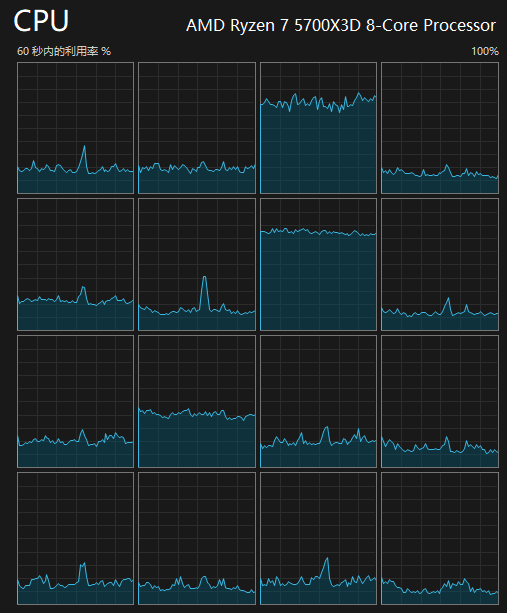
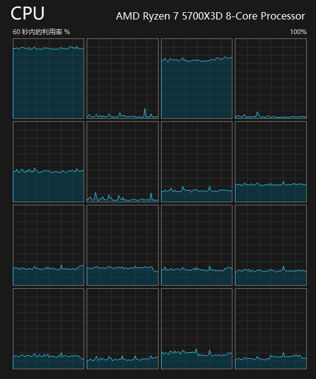

通过观测游戏的线程负载，重新规划线程分配，让高负载主线程独占核心，从而使用完整的单核性能，帮助高端硬件更上一层楼  
Intel和AMD都可以用，尤其对AMD改善更大，让AMD用户可以同等安心玩游戏  

# 食用效果
- ### 食用前

- ### 食用后

# 食用方式
1. 下载
    - 选择1：前往[Release](https://github.com/Yukiriri/ReimaginedScheduling/releases)下载已编译好的版本
    - 选择2：下载仓库进行编译
2. 进入目录运行ReimaginedScheduling.Services.exe
3. 开始玩游戏
4. （可选）观察ReimaginedScheduling.Services.exe的控制台输出

# 计划功能
- 控制面板用户UI
- 使用RTSS同等原理给游戏超采样或插帧（我知道有小黄鸭，但是效果差强人意）

# 调优避坑
- ## 系统设置
    <table>
    <tr><th>系统版本</th>                 <th>设置</th>            <th>N卡</th>       <th>A卡</th>      <th>I卡</th></tr>
    <tr><td rowspan="2">23H2以及以前</td> <td>硬件加速GPU计划</td>  <td>建议不开</td>  <td>不支持</td>    <td rowspan="4">没用过不知道</td></tr>
    <tr>                                 <td>窗口化游戏优化</td>   <td>建议不开</td>   <td>建议不开</td>  </tr>
    <tr><td rowspan="2">24H2以及以后</td> <td>硬件加速GPU计划</td>  <td>不开白不开</td> <td>不支持</td>    </tr>
    <tr>                                 <td>窗口化游戏优化</td>   <td>建议不开</td>   <td>建议开启</td>  </tr>
    </table>
- ## AMD注意项
    - ## BIOS注意项
        - PSS Support(Cool n Quite)
            ### 强烈建议别关
            > 关掉后将连带关闭CPPC等诸多自动性能调节  
            > 带来的严重影响：就算帧率再高，Frametime再直线，游戏渲染出来也是一顿一顿  
            > 打开Windows事件查看器，筛选Kernel-Processor-Power事件，会看见ACPI None，而正常情况是ACPI CPPC  
        - CPPC PC
            ### 建议保持Auto
            > 关掉后会将所有核心的性能上限同步为最雷的核心的上限  
            > 打开Windows事件查看器，筛选Kernel-Processor-Power事件，也可以看见变化  
        - Global C State
            ### 建议关闭
            > 这个选项会影响多数软件计算CPU的正确占用率  
    - ## 电源计划注意项
        不要再尝试 `最小核心放置50%` + `SMT循环` 的组合  
        这个组合将完全破坏我的程序正常运行  

## 致谢
- [dahall/Vanara](https://github.com/dahall/Vanara)

## Stargazers

