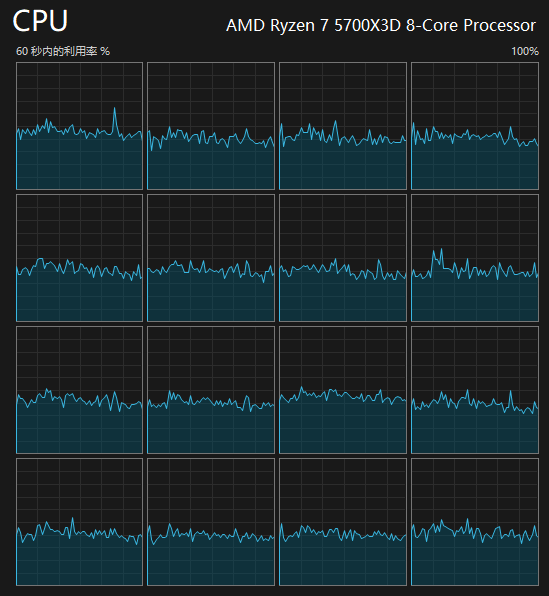

# ReimaginedScheduling

[Build]: https://img.shields.io/github/actions/workflow/status/Yukiriri/ReimaginedScheduling/build.yml?style=for-the-badge
[Downloads]: https://img.shields.io/github/downloads/Yukiriri/ReimaginedScheduling/total?style=for-the-badge
[Actions]: https://github.com/Yukiriri/ReimaginedScheduling/actions/workflows/build.yml
[Releases]: https://github.com/Yukiriri/ReimaginedScheduling/releases
[Stargazers]: https://starchart.cc/Yukiriri/ReimaginedScheduling.svg?variant=adaptive

[![Build]][Actions]
[![Downloads]][Releases]

通过读取前台游戏的线程信息，重新规划线程分配，让线程密集型更符合AMD CPU的设计。  
Intel和AMD都可以用，重点针对AMD改善。  
由于我拥有的硬件和游戏有限，目前已涵盖范围还比较少，需要长期时间完善，如果在特定情况遇到问题或者有建议，欢迎提出。  

> [!NOTE]
> 正在准备重构并加入UI，但依旧还需要咕咕  

# 食用效果

食用前

食用后

# 食用方式
1. 前往 [Releases] 选择下载自动构建的exe  
2. 各exe使用方式  
- `ReimaginedScheduling.Whitelist.exe`  
  1. 直接运行并保持，直到不需要使用  
  2. 把游戏进程名写入同目录的`ReimaginedScheduling.Main.txt`，每一行一个exe  
  3. 开始玩游戏  
- `ReimaginedScheduling.Viewer.exe`  
  给专业人士收集线程数据并向我提交建议用的  

> [!NOTE]
> 修改游戏线程的持久性直到提前关闭程序或者游戏进程结束，非持久修改  

## Stargazers
![Stargazers]
